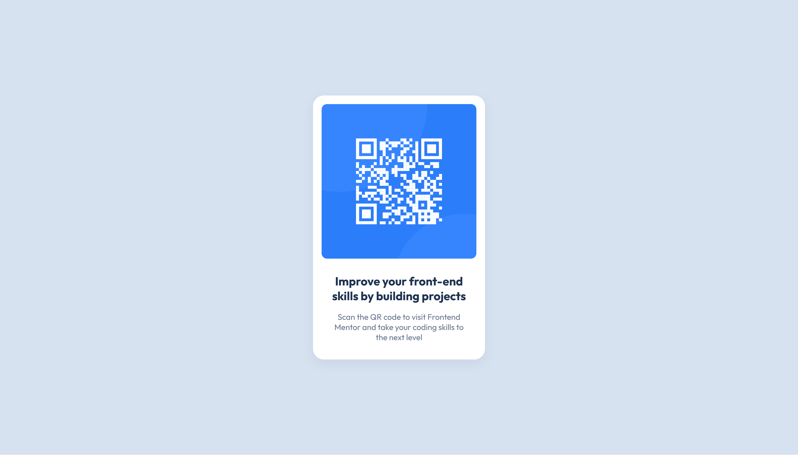

# Frontend Mentor - QR code component solution

This is my solution to the [QR code component challenge on Frontend Mentor](https://www.frontendmentor.io/challenges/qr-code-component-iux_sIO_H). Frontend Mentor challenges help you improve your coding skills by building realistic projects. 

## Table of contents

- [Overview](#overview)
  - [Screenshot](#screenshot)
  - [Links](#links)
- [My process](#my-process)
  - [Built with](#built-with)
  - [What I learned](#what-i-learned)
  - [Continued development](#continued-development)
  - [Useful resources](#useful-resources)
- [Author](#author)
- [Acknowledgments](#acknowledgments)


## Overview

### Screenshot




### Links

- Solution URL: (https://github.com/TemidayoDavid/QR-Modern-design)
- Live Site URL: (https://temidayodavid.github.io/QR-Modern-design/)

## My process

- I downloaded the figma designs.
- I read all instructions and began inspecting the specifications (colour, sizes etc).
- Set up an html project, imported the required fonts and linked up the Html with the css file.
- Tested that the css was working with the Html.
- Wrote the structure of the design first, paying attention to the desktop structure.
- Created the styling using CSS, making sure the design is suitable for screen sizes from 320px and greater.
- Pushed the project to the git hub.
- Published the project on git hub pages.

### Built with

- Semantic HTML5 markup
- CSS custom properties
- Mobile-first workflow


### What I learned


I learnt to position the element equally on the vertical and horizontal axis, using position - "absolute" on the element while setting position to "relative" on the parent container. I was truly excited as I didn't need to use flex-box, justify or align items. Here is a snippet -->

```css
.qr-card {
    position: absolute;
    top: 50%;
    left: 50%;
    transform: translate(-50%, -50%); 
}
```

Also learning that i could use HSL (Hue, Saturation, and Lightness) with box-shadow was new to me, and it was my first time seeing it in use rather than the traditional Hex-code or Rgb color.

```css
.qr-card {
    box-shadow: 0px 8px 20px 1px hsl(216, 15%, 48%, 0.1)
}
```

### Continued development

I would be delving into understanding positioning as regards equal spacing on the webpage. I spent a considerable amount of time trying to align the design the elements, vertically. I wondered why margin: 0 auto worked on the x axis, but seemed to not work when margin: auto auto was set for the vertical. I would find out and see what other best solutions I could use. So learning to do this without using flexbox and other quick fixes would be a great learning for me.

### Useful resources

- [PIXEL PERFECT](https://www.joshwcomeau.com/css/pixel-perfection/) - This helped me for layout reasons, it can be very challenging when the perception of a design on a design application, is quite different when developing. This article, gave me the confidence of inplementing near-perfect design. I really liked the explanations and the UI. I would employ more of the method discussed here to determine pixel perfect desgins for my next projects.

## Author

- Website - [Temidayo David](https://www.your-site.com)
- Frontend Mentor - [@TemidayoDavid](https://www.frontendmentor.io/profile/TemidayoDavid)
- LinkedIn - [temidayoDavid](https://www.linkedin.com/in/temidayodavid/)


## Acknowledgments

I want to thank ChatGpt, it came handy in studying some concept on understanding positioning and box-shadows. Thank you
